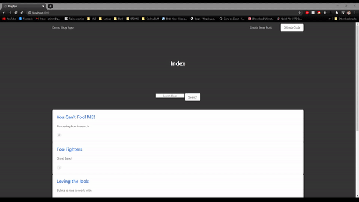
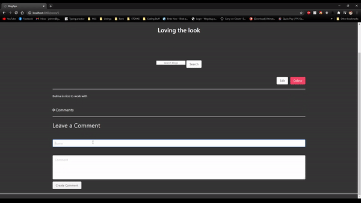

<h1 align="center">Demo Blog App in RoR 💻 </h1>

  A <code>Ruby on Rails</code> blogging website where useres can create blogs and have comments on them

 

  

<h2>
  Showcase:
</h2>

- Shows functionality of the Search Bar
- Shows deleting a comment

 

  

<h2>
  Showcase:
</h2>

- Shows validations working
- Shows Search bar working
- Shows creating a new post

 
 

## Features

- Articles have validations of minimum requirements to make a blog
- View all created blogs/comments
- Ability to write a blog or a comment
- Able to remove blog or comment

## Tech Stack

This web app makes use of the following:

- Ruby on Rails (RoR)
- Bulma - CSS framework based on Flexbox.
